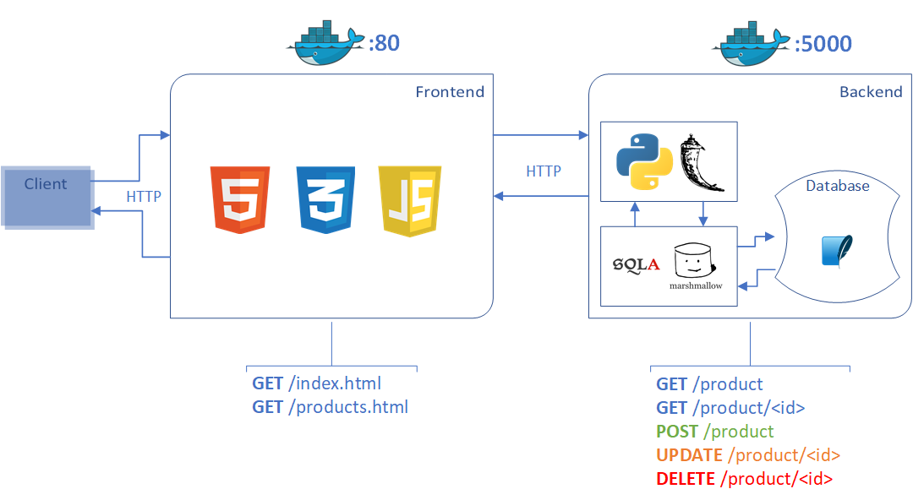

# MaxFlaskStoreDeluxe

## Sommaire

  - [Présentation globale du projet](#prsentation-globale-du-projet)
  - [Présentation de la partie frontend](#prsentation-de-la-partie-frontend)
    - [**Contenu**](#contenu)
    - [**Lancement**](#lancement)
    - [**Utilisation**](#utilisation)
  - [Présentation de la partie backend](#prsentation-de-la-partie-backend)
    - [**Contenu**](#contenu)
    - [**Lancement**](#lancement)
    - [**Utilisation**](#utilisation)
  - [Présentation de la base de données](#prsentation-de-la-base-de-donnes)
  - [Build du projet](#build-du-projet)
  - [Annexes](#annexes)

<br>

## Présentation globale du projet

<br>

MaxFlaskStore DELUXE (MFSD) est une extension du projet MaxFlashStore précédemment développé (https://github.com/MaximeDubost/MaxFlaskStore), étant une API type e-commerce. Ce nouveau projet ajoute une IHM permettant de visualiser les différents produits stockés en base de données.

Le projet est divisé en deux sous-projets :
- `mfsd_frontend_1` correspondant à l'IHM du projet
- `mfsd_backend_1` correspondant à l'API du projet



Le frontend est une application web développée en HTML, CSS et JavaScript. Celui-ci fait appel au backend, qui est un webservice développé en Python Flask. La base de données est intégrée dans le projet backend et utilise SQLite, SQLAlchemy et Marshmallow.

Chaque sous projet est intégré dans un conteneur Docker à part entière et déployé sur Heroku.

<br>

## Présentation de la partie frontend

<br>

### **Contenu**

*MFSD frontend* est une application web type e-commerce développée en HTML, CSS et JavaScript.

L'IHM de l'application permet de visulaliser les produits d'un shop en ligne.

L'application tourne sur le port `:80`.

Celle-ci dispose donc de **2** routes :
- *`/index.html`* `:` Page d'accueil de l'application web
- *`/products.html`* `:` Affichage de la liste des produits disponibles en base de données

<br>

### **Lancement**

L'API est déployée dans un conteneur Docker et fonctionne sur l'adresse suivante :
```
http://localhost:80/
```
Aucune action n'est requise pour le lancement du frontend. Il suffit simplement d'accéder à l'URL suivi d'une des deux routes disponibles.

<br>

### **Utilisation**

Depuis la page d'accueil (*`/index.html`*), l'utilisateur a la possibilité de cliquer sur un bouton le redirigeant vers la page des produits.

Depuis la page des produits (*`/products.html`* ), l'utilisateur a la possibilité de visualiser la liste des produits disponibles en base de données (lecture seule).

<br>

## Présentation de la partie backend

<br>

### **Contenu**

*MFSD backend* est une API type e-commerce développée en Python Flask.

L'API permet d'effectuer les action **CRUD** (Create, Read, Update, Delete) sur des produits d'un shop en ligne.

L'application tourne sur le port `:5000`.

Celle-ci dispose donc de **5** routes :
- **`GET`** *`/product`* `:` Obtenir tous les produits
- **`GET`** *`/product/<id>`* `:` Obtenir un produit
- **`POST`** *`/product`* `:` Ajouter un produit
- **`UPDATE`** *`/product/<id>`* `:` Modifier un produit
- **`DELETE`** *`/product/<id>`* `:` Supprimer un produit

L'API interagit avec une base de données **SQLite** à l'aide des ORM **SQLAlchemy** et **Marshmallow**.

<br>

### **Lancement**

L'API est déployée dans un conteneur Docker et fonctionne sur l'adresse suivante :
```
http://localhost:5000/
```
Celle-ci sera lancée durant l'execution sur Docker Compose, expliqué plus bas.

<br>

### **Utilisation**

Voici 2 manières différentes d'utiliser l'API :

1. Avec la console grace à la commande `curl`
2. Avec un `navigateur web` ( méthodes GET uniquement )

<br>

- ### **Obtenir tous les produits** ( **`GET`** *`/product`* ) 
Commande curl :
```
curl http://localhost:5000/product
```
URL : http://localhost:5000/product

<br>

- ### **Obtenir un produit** ( **`GET`** *`/product/<id>`* )
Commande curl :
```
curl http://localhost:5000/product/1
```
URL : http://localhost:5000/product/1

<br>

- ### **Ajouter un produit** ( **`POST`** *`/product`* )
Commande curl :
```json
curl -d '{"name":"Produit 4","description":"Description produit 4","price":4,"quantity":10}' -H "Content-Type: application/json" -X POST http://localhost:5000/product
```

<br>

- ### **Modifier un produit** ( **`UPDATE`** *`/product/<id>`* )
Commande curl :
```json
curl -d '{"name":"Produit 2 (updated)","description":"Description produit 2 (updated)","price":2,"quantity":10}' -H "Content-Type: application/json" -X PUT http://localhost:5000/product/2
```

<br>

- ### **Supprimer un produit** ( **`DELETE`** *`/product/<id>`* )
Commande curl :
```
curl -X DELETE http://localhost:5000/product/3
```

## Présentation de la base de données

La base de données est une base SQLite. Elle contient une seule et unique table : `Product`

```
+---------------------+
|       Product       |
+---------------------+
| id: int PRIMARY_KEY |
| name: str           |
| description: str    |
| price: float        |
| quantity: int       |
+---------------------+
```

<br>

## Build du projet

La commande a executer à la racine du projet pour lancer les conteneurs Docker de l'ensemble de la pile technique est la suivante :

```bash
docker-compose up --build
```

Une fois la commande effectuée, le résultat attendu est le suivant :
```bash
Successfully built 3b85679cd7bd
Successfully tagged maxflaskstoredeluxe_frontend:latest
Starting mfsd_backend  ... done
Starting mfsd_frontend ... done
Attaching to mfsd_frontend, mfsd_backend
mfsd_frontend | /docker-entrypoint.sh: /docker-entrypoint.d/ is not empty, will attempt to perform configuration
mfsd_frontend | /docker-entrypoint.sh: Looking for shell scripts in /docker-entrypoint.d/
mfsd_frontend | /docker-entrypoint.sh: Launching /docker-entrypoint.d/10-listen-on-ipv6-by-default.sh
mfsd_frontend | 10-listen-on-ipv6-by-default.sh: info: IPv6 listen already enabled
mfsd_frontend | /docker-entrypoint.sh: Launching /docker-entrypoint.d/20-envsubst-on-templates.sh
mfsd_frontend | /docker-entrypoint.sh: Launching /docker-entrypoint.d/30-tune-worker-processes.sh
mfsd_frontend | /docker-entrypoint.sh: Configuration complete; ready for start up
mfsd_frontend | 2021/09/09 10:11:49 [notice] 1#1: using the "epoll" event method
mfsd_frontend | 2021/09/09 10:11:49 [notice] 1#1: nginx/1.21.1
mfsd_frontend | 2021/09/09 10:11:49 [notice] 1#1: built by gcc 10.3.1 20210424 (Alpine 10.3.1_git20210424) 
mfsd_frontend | 2021/09/09 10:11:49 [notice] 1#1: OS: Linux 5.11.0-27-generic
mfsd_frontend | 2021/09/09 10:11:49 [notice] 1#1: getrlimit(RLIMIT_NOFILE): 1048576:1048576
mfsd_frontend | 2021/09/09 10:11:49 [notice] 1#1: start worker processes
mfsd_frontend | 2021/09/09 10:11:49 [notice] 1#1: start worker process 23
mfsd_backend |  * Serving Flask app "app" (lazy loading)
mfsd_backend |  * Environment: production
mfsd_backend |    WARNING: This is a development server. Do not use it in a production deployment.
mfsd_backend |    Use a production WSGI server instead.
mfsd_backend |  * Debug mode: on
mfsd_backend |  * Running on all addresses.
mfsd_backend |    WARNING: This is a development server. Do not use it in a production deployment.
mfsd_backend |  * Running on http://172.19.0.2:5000/ (Press CTRL+C to quit)
mfsd_backend |  * Restarting with stat
mfsd_backend |  * Debugger is active!
mfsd_backend |  * Debugger PIN: 770-172-041
```

<br>

### Annexes

##### Lien vers l'image `maxflaskstoredeluxe_frontend` sur DockerHub : https://hub.docker.com/repository/docker/maximedubost/maxflaskstoredeluxe_frontend
##### Lien vers l'image `maxflaskstoredeluxe_backend` sur DockerHub : https://hub.docker.com/repository/docker/maximedubost/maxflaskstoredeluxe_backend